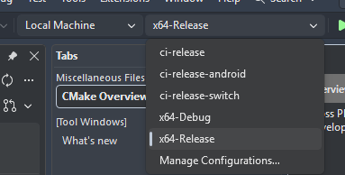
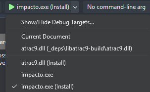

# Dependencies
[Visual Studio Download Link](https://visualstudio.microsoft.com/downloads/)
If you don't plan on using Visual Studio you can just scroll down to "Tools for Visual Studio" and download "Build Tools for Visual Studio"

Visual Studio Installer must have the "Desktop development with C++" optional features installed (you can check if you have them installed by going into the "Tools" menu and selecting "Get Tools and Features...").

# Building with Visual Studio 2022 (or newer)

Ensure that vcpkg package manager, C++ CMake Tools, MSVC Build Tools, and Windows SDK are all checked (the preset checks them by default).

Git command-line tool must be available from within PowerShell. If you don't have it installed, you can download it from https://git-scm.com/downloads

## Visual Studio CMake project setup
- You may have to enable CMakePresets in VS Options -> Cmake

- The included `CMakePresets.json` in the repository root should already have several default build configurations. If you need to make any changes, create a `CMakeUserPresets.json`, of the same format, in the repository root (don't worry, it's gitignored) and change paths if necessary (the directories will be created automatically upon building). Make sure to name the presets differently from the default presets, since user presets cannot override existing presets.

- Open the project with *File->Open->Folder...* in Visual Studio

- Choose desired build configuration in the top menu


- When picking a startup item, make sure to use `impacto.exe (Install)` in the top menu


# Building with CLI or other IDEs

## Terminal Builds, VSCode, etc
- Open "Developer Command Prompt for VS" or "Developer PowerShell for VS" from Start Menu Search. 
- Launch VSCode or similar IDEs from terminal here.

- Run the following to configure CMake and Build
```powershell
cd impacto
# for building release /w symbols build
cmake --preset Release && cmake --build --preset Release
# for building debug build
cmake --preset Debug && cmake --build --preset Debug
```

- The included `CMakePresets.json` contain the presets used above. If you need to make any changes or add a new preset, create a `CMakeUserPresets.json`, of the same format and make any necessary changes.

## CLion
- Open Settings, Navigate to "Build, Execution, Deployment", Navigate to Toolchains
  - Ensure there is a Visual Studio toolchain with the toolset pointing to your Visual Studio or Visual  Studio Build Tools install directory, and set to default.
    - The remaining fields inside the toolchain settings should autopopulate.

- From "Build, Execution, Deployment", Navigate to CMake
  - Click on Debug and Release presets and check "Enable profile"

- Click on the CMake button in the left sidebar, then choose desired CMake Preset profile
- Build.

# Cry

about the absolute state of C++ dependency management